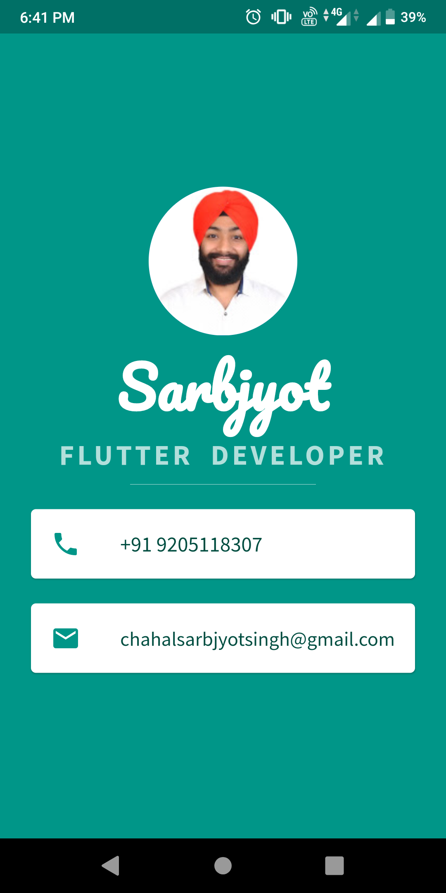

# Mi Card

## Our Goal

We're going to learn more about how to design user interfaces for Flutter apps.

## What we will create

Mi Card is a personal business card. Imagine every time you wanted to give someone your contact details or your business card but you didn't have it on you. Well, now you can get them to download your business card as an app.

## What we will learn

* How to create Stateless Widgets
* How to use Containers to lay out your UI
* How to use Columns and Rows to position your UI elements
* How to add custom fonts
* How to add Material icons
* How to style Text widgets
